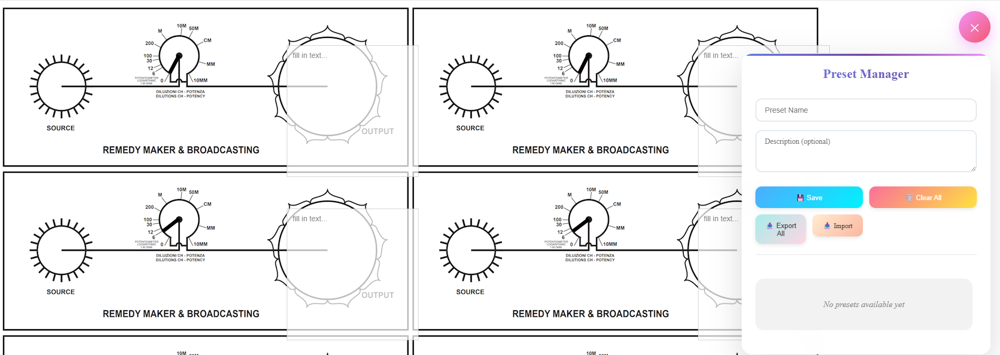

# Remedy Maker 24x




A web-based application for managing and applying presets for remedy creation, designed with a focus on radionic or energy work. Built with HTML, CSS, and JavaScript, it provides a grid-based interface for configuring up to 24 presets, with options to save, clear, export, and import settings.

## Features

- **Preset Management**: Configure up to 24 individual presets in a 6x4 grid layout.
- **Preset Controls**:
  - Save individual presets or all presets at once.
  - Clear all presets to reset the interface.
  - Export all presets to a file.
  - Import presets from a file to populate the grid.
- **Apply to All**: Apply a single preset's settings to all 24 slots for quick configuration.
- **Responsive Design**: Clean, emoji-enhanced interface with a settings toggle for usability.
- **Client-Side**: Runs entirely in the browser with no server-side dependencies.

## Requirements

- A modern web browser (Chrome, Firefox, Safari, Edge, etc.).
- JavaScript must be enabled for functionality.
- No additional dependencies or server setup required.

## Installation

1. Clone the repository:
   ```bash
   git clone https://github.com/yourusername/remedy-maker-24x.git
   cd remedy-maker-24x
   ```

2. Open the `remedy_maker_24x.html` file in a web browser:
   - Double-click the file, or
   - Serve it using a local web server (e.g., with Python):
     ```bash
     python -m http.server 8000
     ```
     Then navigate to `http://localhost:8000/remedy_maker_24x.html`.

## Usage

1. **Open the Application**: Load `remedy_maker_24x.html` in your browser.
2. **Configure Presets**:
   - Click the settings icon (⚙) to toggle the Preset Manager panel.
   - Each of the 24 preset slots has a close button (✕) for individual management (functionality depends on JavaScript implementation).
   - Configure settings for each preset slot (specific fields depend on JavaScript implementation, not visible in provided HTML).
3. **Manage Presets**:
   - Click "Save" (💾) to save the current preset configuration.
   - Click "Clear All" (🗑️) to reset all presets.
   - Click "Export All" (📤) to download all preset configurations as a file.
   - Click "Import" (📥) to upload a file and populate the preset grid.
   - Click "Apply to all" to copy the settings of one preset to all 24 slots.
4. **Monitor Status**: The interface displays "No presets available yet" if no presets are configured (updated dynamically via JavaScript).

## File Structure

- `remedy_maker_24x.html`: The main HTML file containing the application (HTML, CSS, and JavaScript).
- No additional files are required, as all functionality is embedded.

## Notes

- The application is lightweight and runs entirely client-side.
- The provided HTML suggests a 6x4 grid for 24 presets, but specific preset fields (e.g., rates, names) are not defined in the HTML and require JavaScript implementation.
- The interface uses emoji icons (e.g., ⚙, 💾, 🗑️) for a modern, intuitive user experience.
- Export and import functionality depends on JavaScript handling file operations (e.g., JSON or custom format).
- The "Apply to all" feature implies a mechanism to replicate settings across all preset slots, implemented in JavaScript.
- No live preview or rendering is indicated in the HTML; additional functionality may be present in the JavaScript code.

## Contributing

Contributions are welcome! Please submit a pull request or open an issue for bug reports, feature requests, or improvements.

1. Fork the repository.
2. Create a new branch (`git checkout -b feature/your-feature`).
3. Commit your changes (`git commit -m "Add your feature"`).
4. Push to the branch (`git push origin feature/your-feature`).
5. Open a pull request.

## License

This project is licensed under the MIT License. See the `LICENSE` file for details.

## Acknowledgments

- Built with HTML, CSS, and JavaScript for a lightweight, client-side experience.
- Inspired by radionic and energy work tools for preset-based remedy creation.
- Thanks to the open-source community for browser technologies enabling dynamic interfaces.
